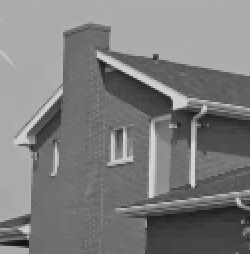
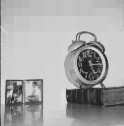
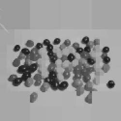
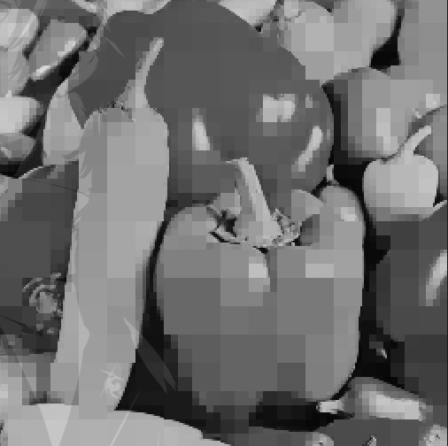

# Compressao-de-Imagem
Trabalho de Laboratório de Programação

## Equipe
- Lucas Delacroix Alves do Rêgo
- Antonio Lucas Barbosa Salvador
- Louise Sampaio Araújo Gonçalves
- Guilherme Pereira De Souza

## Compilação
Para compilar esse projeto execute o seguinte comando:

Certifique de compilar os arquivos com o comando make

Para construir a imagem digite:
./prog.e images/img01.pgm saida.pgm

Para decodificar a imagem digite:
./decode.e reconstrucao.pgm

## Imagens Reconstruidas 

